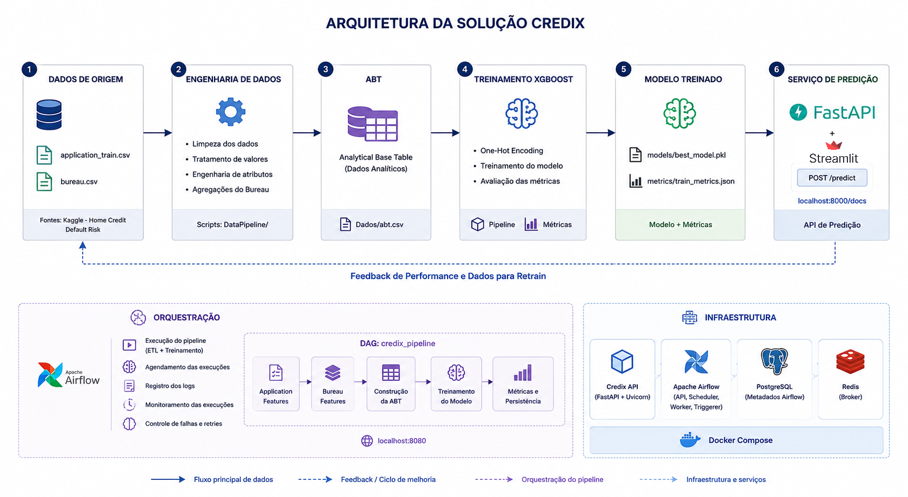

# Credix — Predição de Risco de Inadimplência

## 1. Visão Geral
A **Credix** é uma solução de Machine Learning criada para democratizar e reduzir o custo de acesso a modelos preditivos aplicados à concessão de crédito.

Por meio de uma API, empresas podem estimar a probabilidade de inadimplência e obter informações para apoiar suas decisões de crédito, sem a necessidade de investir tempo e recursos na construção, implantação e manutenção de um modelo próprio.

A solução utiliza dados cadastrais, financeiros e informações do histórico de crédito para identificar padrões associados ao risco de inadimplência. Sua arquitetura contempla todo o ciclo de Machine Learning, incluindo preparação dos dados, treinamento, disponibilização do modelo, monitoramento e evolução contínua.

A proposta da Credix é funcionar como uma solução de **Machine Learning as a Service**, permitindo que diferentes empresas integrem inteligência preditiva aos seus processos de forma simples, escalável e economicamente acessível.

Com a expansão da plataforma e a incorporação governada de novos dados e resultados reais, o modelo poderá ser continuamente monitorado e retreinado com informações mais amplas e diversificadas, aumentando seu potencial de generalização e adaptação a diferentes perfis de clientes e operações de crédito.

O projeto contempla as principais etapas do ciclo de vida de Machine Learning:

- preparação e tratamento dos dados;
- engenharia de atributos;
- construção da ABT — Analytical Base Table;
- treinamento do modelo;
- avaliação das métricas;
- persistência do modelo treinado;
- orquestração do pipeline com Apache Airflow;
- disponibilização do modelo por meio de uma API REST desenvolvida com FastAPI;
- conteinerização da infraestrutura com Docker Compose;
- proposta de monitoramento do modelo;
- proposta de monitoramento de Data Drift;
- estratégia de retreinamento;
- proposta de automações baseadas nas previsões;
- integração futura com agentes de Inteligência Artificial.

---
## 1.1 Estrutura do Projeto (Etapa em Grupo + Etapa Individual)

### Estrutura Atual do Repositório

```text
airflow/
api/
assets/
dados/
datapipeline/
mlops/
model/
models/
monitoring/
notebooks/
reports/
streamlit/

README.md
docker-compose.yml
requirements.txt
```

O projeto Credix foi desenvolvido em duas etapas complementares.

### Etapa em Grupo

A primeira etapa teve como objetivo desenvolver a solução analítica para predição de inadimplência, contemplando:

- entendimento do problema de negócio;
- análise exploratória dos dados (EDA);
- construção da ABT (Analytical Base Table);
- engenharia de atributos;
- treinamento dos modelos de Machine Learning;
- avaliação das métricas de desempenho;
- interpretabilidade do modelo utilizando SHAP.

### Etapa Individual apresentada neste git

A segunda etapa teve como objetivo evoluir a solução para um cenário próximo ao ambiente de produção, contemplando:

- arquitetura funcional completa;
- disponibilização do modelo como serviço de predição;
- desenvolvimento de API utilizando FastAPI;
- desenvolvimento de interface utilizando Streamlit;
- conteinerização da solução com Docker Compose;
- orquestração do pipeline;
- monitoramento de dados e do modelo;
- estratégia de retreinamento;
- automações baseadas em Machine Learning;
- proposta de utilização de agentes de Inteligência Artificial.

Dessa forma, a etapa individual representa a evolução da solução desenvolvida em grupo, expandindo o projeto para conceitos de MLOps, deployment e operação em produção.


---

## 2. Objetivo

O objetivo do Credix é estimar a probabilidade de inadimplência de uma solicitação de crédito e classificar o nível de risco do cliente.

A API recebe informações cadastrais e financeiras e retorna:

- probabilidade estimada de inadimplência;
- nível de risco calculado.

Exemplo de resposta:

```json
{
  "probabilidade_inadimplencia": 0.7409,
  "nivel_risco": "alto"
}
```

As faixas de risco utilizadas são:

| Probabilidade de inadimplência | Nível de risco |
|---|---|
| Menor que 50% | Baixo |
| Entre 50% e 70% | Médio |
| Igual ou superior a 70% | Alto |

Além da probabilidade gerada pelo modelo, regras de negócio podem ser utilizadas para tratar situações extremas.

Por exemplo, quando o comprometimento da renda é igual ou superior a 100%, a solicitação é classificada diretamente como risco alto.

---

## 3. Fonte dos Dados

O projeto utiliza dados da competição **Home Credit Default Risk**, disponibilizada na plataforma Kaggle.

Os principais conjuntos de dados utilizados são:

| Arquivo | Descrição |
|---|---|
| `application_train.csv` | Dados cadastrais, financeiros e informações das solicitações |
| `bureau.csv` | Histórico de operações de crédito registradas para os clientes |

Os dados incluem informações relacionadas a:

- renda;
- valor solicitado;
- valor da parcela;
- valor do bem;
- idade;
- escolaridade;
- estado civil;
- tempo de emprego;
- quantidade de créditos;
- quantidade de créditos ativos;
- valor total dos créditos;
- valor total das dívidas;
- histórico de crédito.

A variável alvo utilizada no treinamento é a coluna `TARGET`.

| TARGET | Significado |
|---:|---|
| `0` | Cliente não inadimplente |
| `1` | Cliente inadimplente |

---

## 4. Arquitetura da Solução

A arquitetura contempla o fluxo completo, desde os dados de origem até a disponibilização do modelo como serviço de predição.



O Apache Airflow é responsável pela orquestração do pipeline de dados e treinamento.

A FastAPI disponibiliza o modelo como um serviço REST de predição.

O Docker Compose gerencia os containers e permite executar os componentes da solução de forma integrada.

---

## 5. Pipeline de Dados

O pipeline de dados é responsável pela preparação das informações utilizadas pelo modelo.

A estrutura atual do projeto contém scripts para construção da base analítica (ABT) a partir dos dados do Home Credit.

As etapas principais são:

```text
application_train.csv
            │
            ▼
datapipeline/application_features.py
            │
            ▼
datapipeline/bureau_features.py
            │
            ▼
datapipeline/generate_abt.py
            │
            ▼
ABT utilizada no treinamento
```

### 5.1 Application Features

O arquivo:

```text
datapipeline/application_features.py
```

é responsável pelo tratamento das informações cadastrais e financeiras da base de solicitações.

As principais atividades são:

- seleção das colunas utilizadas;
- tratamento de valores ausentes;
- transformação das variáveis;
- cálculo de novas features financeiras;
- geração da base tratada.

### 5.2 Bureau Features

O arquivo:

```text
datapipeline/bureau_features.py
```

é responsável pela agregação das informações do histórico de crédito.

São calculadas informações como:

- quantidade total de créditos;
- quantidade de créditos ativos;
- valor total dos créditos;
- valor total das dívidas;
- relação entre dívida e crédito.

### 5.3 Construção da ABT

O arquivo:

```text
datapipeline/generate_abt.py
```

realiza a integração das informações cadastrais e das informações do Bureau.

A ABT gerada é utilizada como base para o treinamento dos modelos de Machine Learning.

---

## 6. Engenharia de Atributos

Foram criadas variáveis derivadas para representar as relações entre renda, crédito, parcela, bem e endividamento.

| Feature | Descrição |
|---|---|
| `CREDITO_RENDA` | Relação entre o valor do crédito e a renda |
| `PARCELA_RENDA` | Relação entre o valor da parcela e a renda |
| `BEM_RENDA` | Relação entre o valor do bem e a renda |
| `RENDA_LIVRE` | Estimativa da renda restante após o pagamento da parcela |
| `COMPROMETIMENTO_RENDA` | Percentual da renda comprometido pela parcela |
| `PARCELA_MAIOR_RENDA` | Indicador de parcela superior à renda |
| `CREDITO_ALTO` | Indicador de crédito elevado em relação à renda |
| `PRAZO_ESTIMADO` | Estimativa da quantidade de parcelas |
| `BUREAU_QTD_CREDITOS` | Quantidade de créditos registrados |
| `BUREAU_QTD_ATIVOS` | Quantidade de créditos ativos |
| `BUREAU_TOTAL_CREDITO` | Valor total dos créditos registrados |
| `BUREAU_TOTAL_DIVIDA` | Valor total das dívidas |
| `BUREAU_DEBT_RATIO` | Relação entre dívida e crédito |

As colunas utilizadas no treinamento são:

```text
AMT_INCOME_TOTAL
AMT_CREDIT
AMT_ANNUITY
AMT_GOODS_PRICE
NAME_EDUCATION_TYPE
NAME_FAMILY_STATUS
IDADE
TEMPO_EMPRESA
CREDITO_RENDA
PARCELA_RENDA
BEM_RENDA
RENDA_LIVRE
COMPROMETIMENTO_RENDA
PARCELA_MAIOR_RENDA
CREDITO_ALTO
PRAZO_ESTIMADO
BUREAU_QTD_CREDITOS
BUREAU_QTD_ATIVOS
BUREAU_TOTAL_CREDITO
BUREAU_TOTAL_DIVIDA
BUREAU_DEBT_RATIO
```

---

## 7. Treinamento do Modelo

O problema foi tratado como uma tarefa de **classificação binária**.

Durante a etapa de experimentação, foram avaliados diferentes algoritmos de classificação, incluindo:
- Regressão Logística
- Random Forest
- XGBoost

Os modelos foram comparados utilizando métricas adequadas ao contexto de risco de crédito, considerando principalmente:

- Recall
- Precision
- F1-score
- ROC AUC
- capacidade de identificação da classe inadimplente

A acurácia não foi utilizada isoladamente como critério de seleção, pois o conjunto de dados apresenta desbalanceamento entre clientes inadimplentes e não inadimplentes. 
Nesse cenário, um modelo poderia obter uma acurácia elevada ao classificar a maioria dos clientes como não inadimplentes, mas apresentar baixa capacidade de identificar os clientes que realmente representam risco.

Após a comparação dos resultados, o `XGBClassifier` foi selecionado como o modelo final do projeto.

O XGBoost apresentou o melhor equilíbrio entre a capacidade de discriminação dos clientes e a identificação da classe inadimplente, considerando as métricas avaliadas. 
O modelo também apresentou maior adequação ao problema por possuir características importantes, como:

- capacidade de identificar relações não lineares entre as variáveis;
- combinação sequencial de múltiplas árvores de decisão;
- correção dos erros cometidos pelas árvores anteriores;
- bom desempenho em dados tabulares;
- capacidade de representar interações complexas entre variáveis financeiras e cadastrais;
- suporte a técnicas para tratamento do desbalanceamento das classes;
- disponibilização de probabilidades de inadimplência por meio do método `predict_proba()`.

Para reduzir o impacto do desbalanceamento da variável alvo, foi utilizado o parâmetro:  scale_pos_weight=12

O pipeline de treinamento executa as seguintes etapas:

1. leitura da ABT;
2. separação das variáveis explicativas e da variável alvo;
3. identificação das variáveis categóricas;
4. aplicação de One-Hot Encoding;
5. divisão dos dados em treino e teste;
6. treinamento do modelo XGBoost;
7. geração das probabilidades;
8. geração das classes previstas;
9. cálculo das métricas;
10. persistência do pipeline treinado;
11. persistência das métricas.

O pré-processamento e o modelo são armazenados em um único objeto `Pipeline` do Scikit-learn.

Dessa forma, as mesmas transformações utilizadas durante o treinamento são aplicadas automaticamente durante as previsões realizadas pela API.

Os artefatos gerados durante o treinamento são armazenados em:

```text
assets/modelo.pkl
assets/preprocessor.pkl
assets/feature_names.json
assets/metrics.json
```

Os indicadores de monitoramento de drift são armazenados em:

```text
reports/psi_report.csv
```

---

## 8. Métricas do Modelo

Resultados obtidos na execução atual:

| Métrica | Resultado |
|---|---:|
| Accuracy | 0,6487 |
| Precision | 0,1416 |
| Recall | 0,6622 |
| F1-score | 0,2333 |
| ROC AUC | 0,7117 |

O conjunto de dados apresenta desbalanceamento entre clientes inadimplentes e não inadimplentes.

Por esse motivo, a avaliação do modelo não considera apenas a acurácia.

O **recall** possui relevância para o problema porque representa a capacidade do modelo de identificar os clientes que realmente se tornam inadimplentes.

Um falso negativo ocorre quando:

```text
Previsão do modelo:
Cliente não inadimplente

Resultado observado:
Cliente inadimplente
```

Esse tipo de erro pode representar risco financeiro, pois um cliente com possibilidade de inadimplência pode não ser identificado pelo modelo.

A métrica ROC AUC é utilizada para avaliar a capacidade do modelo de diferenciar clientes com maior e menor risco de inadimplência.

---

## 9. Manutenção e Evolução do Modelo

A manutenção do modelo Credix será realizada por meio do acompanhamento contínuo das previsões e da comparação posterior com o comportamento real dos clientes.

No momento de cada predição, serão armazenadas as informações necessárias para permitir a rastreabilidade do resultado, incluindo:

- identificador da solicitação ou do cliente;
- data da previsão;
- probabilidade estimada de inadimplência;
- nível de risco atribuído;
- classe prevista;
- versão do modelo utilizada;
- principais variáveis utilizadas na previsão;
- indicação de eventual ação preventiva aplicada ao cliente.

Após um período de maturação de **seis meses**, as previsões serão comparadas com o comportamento efetivamente observado.

O período de acompanhamento e o fornecimento dos resultados reais deverão estar previstos contratualmente, garantindo a disponibilidade dos dados necessários para avaliação, manutenção e evolução contínua do modelo.

O fluxo de monitoramento será realizado da seguinte forma:

```text
Predição realizada
        │
        ▼
Armazenamento da previsão
        │
        ▼
Acompanhamento do cliente
        │
        ▼
Período de maturação de 6 meses
        │
        ▼
Recebimento do resultado observado
        │
        ▼
Comparação entre previsão e realidade
        │
        ▼
Recálculo das métricas
        │
        ▼
Avaliação da necessidade de retreinamento
```
---

## 10. API de Predição

O modelo é disponibilizado por meio de uma API REST desenvolvida com FastAPI.
A ideia é que os clientes consultem o modelo por meio da API.

A API utiliza:

- FastAPI para criação dos endpoints;
- Pydantic para validação dos dados;
- Uvicorn como servidor;
- Joblib para carregamento do modelo treinado.

A documentação Swagger pode ser acessada em:

```text
http://localhost:8000/docs
```

Endpoint de predição:

```http
POST /predict
```

Exemplo de requisição:

```json
{
  "idade": 42,
  "sexo": "F",
  "possui_carro": true,
  "possui_imovel": true,
  "escolaridade": "Higher education",
  "estado_civil": "Married",
  "renda_anual": 250000,
  "tempo_empresa": 12,
  "valor_credito": 180000,
  "valor_bem": 220000,
  "valor_parcela": 3500,
  "qtd_creditos": 4,
  "qtd_creditos_ativos": 2,
  "valor_total_credito": 600000,
  "valor_total_divida": 50000
}
```

Exemplo de resposta:

```json
{
  "probabilidade_inadimplencia": 0.0821,
  "nivel_risco": "baixo"
}
```

---
## 11. Orquestração com Apache Airflow

O Apache Airflow é utilizado para executar e monitorar o pipeline de Machine Learning.

A interface pode ser acessada em:

```text
http://localhost:8080
```

A DAG executa o seguinte fluxo lógico:

```text
Início
   │
   ▼
Application Features
   │
   ▼
Bureau Features
   │
   ▼
Construção da ABT
   │
   ▼
Treinamento do Modelo
   │
   ▼
Avaliação
   │
   ▼
Persistência do Modelo
   │
   ▼
Fim
```

O projeto contém o arquivo:

```text
mlops/pipeline_orchestration.py
```

que representa a orquestração simplificada das principais etapas do pipeline.

As etapas contempladas incluem:

```text
datapipeline/application_features.py

datapipeline/bureau_features.py

datapipeline/generate_abt.py

model/train.py
```

---

## 12. Infraestrutura com Docker Compose

A infraestrutura é gerenciada pelo Docker Compose.

Os principais serviços são:

| Serviço | Responsabilidade |
|---|---|
| `credix-api` | Disponibilização do modelo por FastAPI |
| `airflow-apiserver` | Interface e API do Airflow |
| `airflow-scheduler` | Agendamento das DAGs |
| `airflow-worker` | Execução das tarefas |
| `airflow-dag-processor` | Processamento das DAGs |
| `airflow-triggerer` | Execução de tarefas assíncronas |
| `postgres` | Banco de metadados do Airflow |
| `redis` | Broker utilizado pelo Celery Executor |

---


### 13 Registro das Previsões

Cada previsão deverá armazenar:

| Campo | Descrição |
|---|---|
| `id_solicitacao` | Identificador da solicitação |
| `data_previsao` | Data e hora da previsão |
| `probabilidade_inadimplencia` | Probabilidade calculada pelo modelo |
| `classe_prevista` | Classe binária prevista |
| `nivel_risco` | Classificação de risco |
| `versao_modelo` | Versão utilizada |

Exemplo:

```json
{
  "id_solicitacao": 1001,
  "data_previsao": "2026-07-10T10:30:00",
  "probabilidade_inadimplencia": 0.7409,
  "classe_prevista": 1,
  "nivel_risco": "alto",
  "versao_modelo": "1.0"
}
```
---
### 14. Monitoramento de Dados e Modelo

Conforme proposto para a etapa individual, foi definida uma estratégia de monitoramento para acompanhar a qualidade dos dados e a performance do modelo em produção.

#### Monitoramento de Dados

O monitoramento dos dados tem como objetivo identificar alterações relevantes na distribuição das variáveis utilizadas pelo modelo.

As principais verificações incluem:

- média
- mediana
- desvio padrão
- percentual de valores nulos
- PSI (Population Stability Index) 

Valores elevados de PSI podem indicar mudanças significativas no comportamento dos dados, caracterizando Data Drift.

#### Monitoramento de Performance

Após o período de maturação dos contratos, as previsões poderão ser comparadas aos resultados efetivamente observados.

As métricas monitoradas incluem:

- Recall
- Precision
- F1-Score
- ROC AUC
- Taxa de falsos negativos

#### Monitoramento Operacional

Também podem ser monitorados:

- falhas de execução
- indisponibilidade da API
- tempo de resposta
- falhas de pipeline
- consumo de recursos computacionais


---

## 15. Estratégia de Retreinamento

O retreinamento poderá ser iniciado quando ocorrer uma ou mais condições:

- redução relevante do ROC AUC;
- redução do recall;
- redução do F1-score;
- aumento da taxa de falsos negativos;
- PSI superior a 0,25 em múltiplas variáveis críticas;
- alteração relevante na distribuição das previsões;
- disponibilidade de novos dados rotulados.

Fluxo proposto:

```text
Monitoramento
       │
       ▼
Degradação detectada?
       │
       ├── Não
       │     │
       │     ▼
       │ Manter modelo atual
       │
       └── Sim
             │
             ▼
Treinar modelo candidato
             │
             ▼
Comparar modelo candidato
com o modelo atual
             │
             ▼
Novo modelo atende
aos critérios?
       │
       ├── Não
       │     │
       │     ▼
       │ Manter modelo atual
       │
       └── Sim
             │
             ▼
Promover nova versão
```

O novo modelo somente deverá substituir o modelo atual caso atenda aos limites mínimos definidos e apresente desempenho adequado nos dados de validação.

---

## 16. Ações Automatizadas e Agentes de IA (Etapa Individual)

Este item **não é implementado nem demonstrado** neste projeto — é uma proposta de como as
previsões do modelo Credix poderiam acionar ações automatizadas em produção, conectando
**Machine Learning**, **automação** e **agentes de Inteligência Artificial** em um contexto
real de negócio (a Credix vendendo essa inteligência via API B2B para fintechs, varejistas
e cooperativas de crédito).

### 16.1 Princípio geral: nem toda ação automatizada precisa de um agente de IA

A proposta separa as ações em duas camadas conforme a natureza da decisão:

| Camada | Quando se aplica | Exemplo |
| --- | --- | --- |
| **Automação determinística** (regra, sem IA) | Decisão clara, sem ambiguidade | Faixa de risco baixo/alto já define a ação |
| **Agente de IA** | Decisão exige julgamento, linguagem natural ou simulação | Negociar condições, explicar uma recusa, investigar uma anomalia |

Essa separação evita o uso desnecessário de agentes onde uma regra simples já resolve —
e concentra o uso de IA exatamente onde ela agrega valor real.

### 16.2 Camada 1 — Roteamento automático por faixa de risco (regra, sem IA)

```text
Previsão do modelo (prob. de inadimplência)
              │
   ┌──────────┼──────────┐
   ▼          ▼          ▼
Baixo      Médio       Alto
risco      risco       risco
   │          │          │
   ▼          ▼          ▼
Aprovação   Agente de   Recusa ou
automática    IA        escalonamento
(<1s, sem   (seção      para análise
 humano)     16.3)       humana
```

Reforça o valor central do produto Credix: decisão em tempo real, sem intervenção humana
nos casos claros. Só a faixa de risco médio (ambígua) segue para um agente.

### 16.3 Camada 2 — Agente "copiloto de crédito" para risco médio

Para solicitações na faixa ambígua, um agente de IA recebe a probabilidade prevista +
os dados financeiros do solicitante e **simula contrapropostas automaticamente**, em vez
de um analista ter que testar isso manualmente:

- reduzir o valor do crédito ou aumentar a entrada até a probabilidade cair dentro da
  política aceitável;
- recomendar prazo/parcela compatível com a capacidade financeira do cliente;
- sugerir taxa de juros que compense o risco residual;
- decidir quando não há alternativa viável e encaminhar para análise humana.

Entre as informações que o agente consome estão a probabilidade e nível de risco, renda,
valor solicitado, comprometimento de renda, e o histórico de crédito (créditos ativos,
dívida total) — as mesmas variáveis já usadas pelo modelo.

### 16.4 Camada 3 — Agente de explicação para o cliente final

Reaproveita diretamente o SHAP (interpretabilidade do modelo, já mapeado como diferencial
da Credix): quando um crédito é negado, o agente traduz as variáveis que mais pesaram na
decisão em uma explicação em linguagem simples para o solicitante — por exemplo, "seu
pedido foi impactado principalmente pelo comprometimento de renda atual; reduzir esse
valor ou regularizar dívidas em aberto pode melhorar sua próxima avaliação" — em vez de
só devolver um número de probabilidade. Isso não é um recurso novo: é o mesmo SHAP do
modelo, automatizado como texto.

### 16.5 Camada 4 — Agente de monitoramento e auditoria contínua

Conecta-se à estratégia de retreinamento (seção 15) quando o monitoramento de drift
detecta degradação (ex.: PSI acima do limite), em vez de só disparar um alerta numérico,
um agente investiga automaticamente a amostra de casos recentes com maior erro, resume um
relatório em linguagem natural para o time de ML (ex.: "o modelo está errando mais em
clientes autônomos nos últimos 30 dias") e recomenda se é caso de retreino ou apenas
ruído estatístico. A decisão de promover um novo modelo continua sendo humana — o agente
prepara a investigação, não decide sozinho.

### 16.6 Fluxo simplificado, ponta a ponta

```text
Solicitação de crédito
          │
          ▼
Modelo Credix (probabilidade + SHAP)
          │
          ▼
   Motor de decisão automatizada
          │
   ┌──────┼──────────────┐
   ▼      ▼              ▼
Aprova  Agente          Recusa +
auto.   copiloto        Agente de
(16.2)  (16.3)          explicação
                         (16.4)
          │
          ▼
Validação humana quando necessário
          │
          ▼
Resultado real observado (6 meses)
          │
          ▼
Agente de monitoramento (16.5)
          │
          ▼
Retreino (decisão humana, seção 15)
```

### 16.7 Por que essa arquitetura

O ponto central da proposta: **automação determinística resolve os casos claros** (faixas
de risco bem definidas); **o agente de IA entra exatamente onde há ambiguidade, linguagem
natural ou simulação envolvida** (negociar condições, explicar uma recusa, investigar uma
anomalia). Isso mostra uma aplicação madura de IA agente — não "IA em tudo", mas IA onde
ela resolve um problema que regra simples não resolve.

---

## 17. Próximos Passos

As principais evoluções planejadas são:

- armazenar as previsões em banco de dados
- incluir identificador da solicitação na API
- criar endpoint de saúde da API
- implementar versionamento do modelo
- implementar monitoramento automatizado do modelo
- implementar monitoramento da performance real
- criar alertas de degradação
- implementar comparação entre modelo atual e modelo candidato
- implementar testes automatizados
- criar dashboards de monitoramento
- implementar CI/CD para testes e deploy
- implementar autenticação na API
- disponibilizar a solução em ambiente de nuvem
- implementar agente de ia

---

## 18. Como Executar

### Criar ambiente virtual

```bash
python -m venv .venv
```

### Ativar ambiente virtual

```bash
.venv\Scripts\activate
```

### Instalar dependências

```bash
pip install -r requirements.txt
```

### Executar geração da base analítica

```bash
python datapipeline/application_features.py
python datapipeline/bureau_features.py
python datapipeline/generate_abt.py
```

### Treinar modelo

```bash
python model/train.py
```

### Executar predição local

```bash
python model/predict.py
```

### Executar API FastAPI

```bash
uvicorn api.app:app --reload
```

A documentação Swagger pode ser acessada em:

```text
http://localhost:8000/docs
```

### Executar aplicação Streamlit

```bash
streamlit run streamlit/app.py
```

### Executar orquestração simplificada

```bash
python mlops/pipeline_orchestration.py
```

### Executar infraestrutura completa

```bash
docker-compose up --build
```

---
## 19. Notebooks e Relatórios

O projeto também disponibiliza os notebooks de análise exploratória e avaliação do modelo:

```text
notebooks/exp_analysis.ipynb
notebooks/evaluation.ipynb
```

Os relatórios, métricas, figuras e análises de monitoramento estão disponíveis em:

```text
reports/
reports/figures/
```

---
## 20. Considerações Finais

O Credix demonstra uma arquitetura funcional de Machine Learning que integra:

- engenharia de dados;
- construção da base analítica;
- treinamento de modelo;
- avaliação de métricas;
- orquestração;
- disponibilização do modelo;
- infraestrutura conteinerizada;
- monitoramento;
- automação.

A utilização do Apache Airflow permite controlar a execução do pipeline e acompanhar falhas.

A FastAPI disponibiliza o modelo como um serviço REST de predição.

O Docker Compose permite executar os componentes da solução de forma integrada e reproduzível.

A estratégia de monitoramento permite acompanhar alterações nos dados, mudanças nas previsões e possível degradação da performance do modelo após a obtenção dos resultados reais.

O projeto apresenta uma base para a evolução de uma solução de Machine Learning em produção, incluindo versionamento, monitoramento, retreinamento e integração com agentes de Inteligência Artificial.
